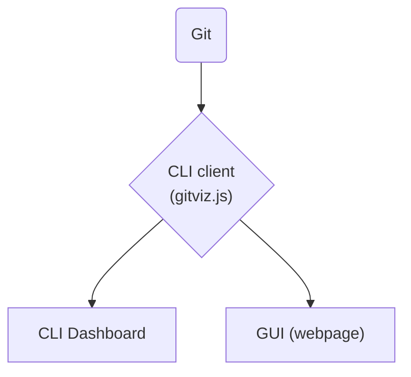
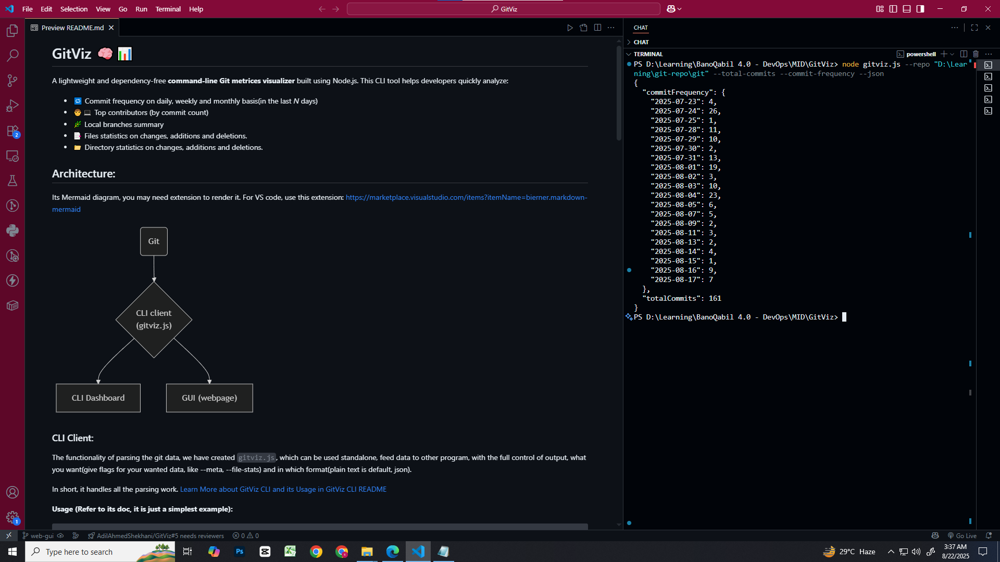
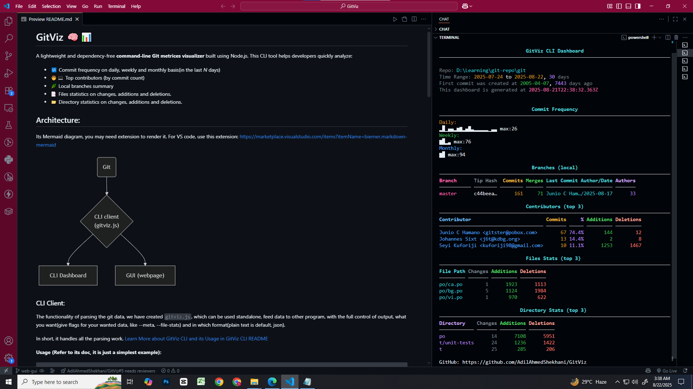
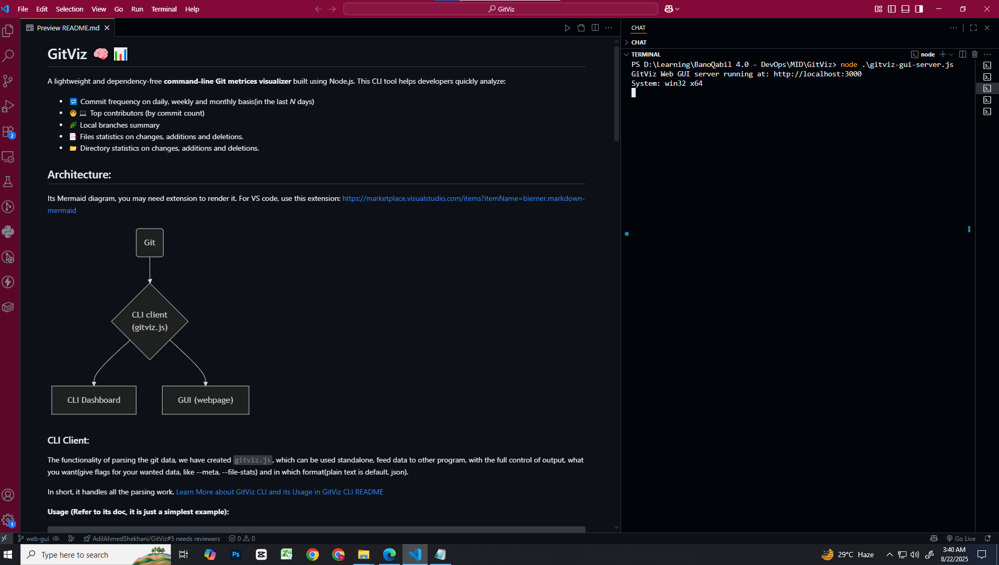

# GitViz 🧠📊

A lightweight and dependency-free **command-line Git metrices visualizer** built using Node.js. This CLI tool helps developers quickly analyze:

-   🔁 Commit frequency on daily, weekly and monthly basis(in the last _N_ days)
-   🧑‍💻 Top contributors (by commit count)
-   🌿 Local branches summary
-   📑 Files statistics on changes, additions and deletions.
-   📁 Directory statistics on changes, additions and deletions.

<!-- All through clean, colored ASCII output directly in the terminal. -->

## Architecture:

Its Mermaid diagram, you may need extension to render it. For VS code, use this extension: https://marketplace.visualstudio.com/items?itemName=bierner.markdown-mermaid



### CLI Client: 
The functionality of parsing the git data, we have created `gitviz.js`, which can be used standalone, feed data to other program, with the full control of output, what you want(give flags for your wanted data, like --meta, --file-stats) and in which format(plain text is default, json).

In short, it handles all the parsing work. [Learn More about GitViz CLI and its Usage in GitViz CLI README](./GitViz-README.md)

**Usage (Refer to its doc, it is just a simplest example):** 
```bash
# Current directory
node gitviz.js     

# Specific repository
node gitviz.js --repo /path/to/repo      

# Specific sections in specified format
node gitviz.js --contributors --branches 
```

**Requirements:** Node.js and Git installed.



### CLI Dashboard: 
A formatted terminal dashboard built on the CLI client. `gitviz-cli-dashboard.js` provides structured, colorized output with tables and visual elements. Accepts same flags as CLI client but outputs beautifully formatted dashboard.

**Usage:**
```bash
# Current directory
node gitviz-cli-dashboard.js                           

# Specific repository
node gitviz-cli-dashboard.js --repo /path/to/repo --full-history
```

**Requirements:** CLI client should be in the same directory.



### GUI (Web Dashboard): 
A modern web interface built on the CLI client. `gitviz-gui.html` provides interactive charts, responsive design, and demo data functionality.

**Usage:**
```bash
# 1. Start the server
node gitviz-gui-server.js

# 2. Open in browser
open gitviz-gui.html    # or double-click the HTML file
```

**Requirements:** 
- **Server needed**: `gitviz-gui-server.js` must be running to get live data from CLI client.
- **Browser**: Any modern web browser
  #### **OR**
- **Demo mode**: Works offline with "Use Demo Data" button

__GUI__


__GUI Server to Power it__



---

## 🚀 Features

-   **Commit Frequency Graph** over the past _N_ days
-   **Top Contributors** with commit share and percentages
-   **Branches Summary** including tip SHA, last commit date, and commit count
-   **Author filtering** using regex
-   Works with **any Git repository** (just point with `--repo`)
-   **No external dependencies** — pure Node.js + Git CLI

---

## 🔧 Requirements

### All Components
- **Node.js** (v12 or higher)
- **Git** (available in PATH)
- **No npm dependencies** — zero external packages

### GUI Specific
- **Server Required**: `gitviz-gui-server.js` must be running for live repository analysis
- **Browser**: Any modern web browser (Chrome, Firefox, Safari, Edge)
- **Demo Mode**: Works completely offline with mock data

### Network Requirements
- **CLI + CLI Dashboard**: Work completely offline
- **GUI Live Mode**: Requires localhost:3000 connection to server
- **GUI Demo Mode**: No network connection needed

---

## 📦 Quick Start

**No installation needed** — pure Node.js scripts with no external dependencies.

```bash
# Clone and navigate
git clone https://github.com/your-username/GitViz
cd GitViz

# CLI Usage
node gitviz.js --help                    # See all options
node gitviz.js --meta --contributors     # Quick overview

# CLI Dashboard Usage  
node gitviz-cli-dashboard.js             # Beautiful terminal dashboard
node gitviz-cli-dashboard.js --repo ../other-project

# GUI Usage
node gitviz-gui-server.js               # Start server (Terminal 1)
open gitviz-gui.html                     # Open in browser (or double-click)
```

## 🎯 Usage Examples

### CLI Client Examples
```bash
# Basic repository information
node gitviz.js --meta

# Contributors with statistics  
node gitviz.js --contributors --contributor-stats

# Full analysis in JSON format
node gitviz.js --json --meta --contributors --branches --file-stats --commit-frequency

# Analyze specific repository
node gitviz.js --repo "/path/to/repo" --contributors --top 10
```

### CLI Dashboard Examples
```bash
# Current repository dashboard
node gitviz-cli-dashboard.js

# Specific repository with custom flags
node gitviz-cli-dashboard.js --repo "../other-project" --file-stats --branches

# Focus on contributors and file activity
node gitviz-cli-dashboard.js --contributors --contributor-stats --file-stats
```

### GUI Dashboard
1. **Start Server**: `node gitviz-gui-server.js` (keep running)
2. **Open GUI**: Double-click `gitviz-gui.html` or open in browser
3. **Enter Repository Path**: Type path or use "Current Directory"
4. **Generate Dashboard**: Click "Generate Dashboard" 
5. **Demo Mode**: Click "Use Demo Data" for offline preview
