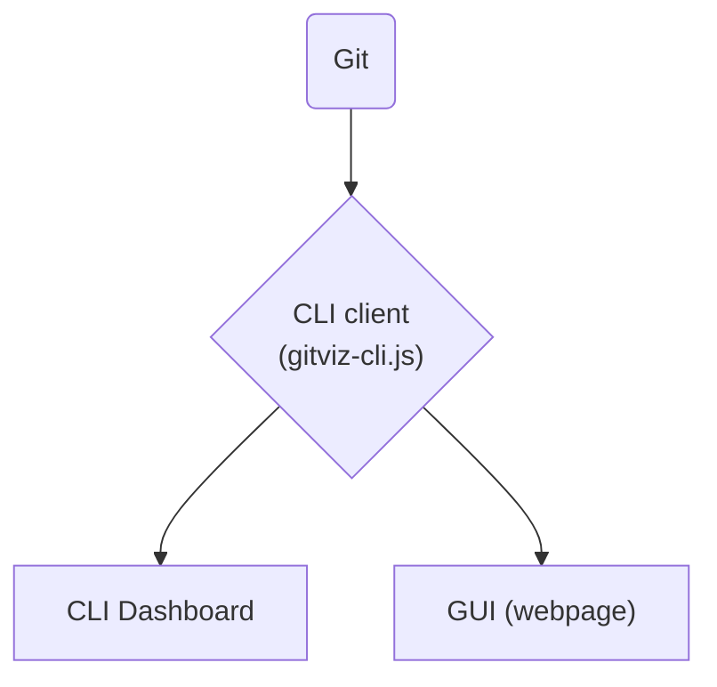

# GitViz 🧠📊

A lightweight and dependency-free **command-line Git metrices visualizer** built using Node.js. This CLI tool helps developers quickly analyze:

- 🔁 Commit frequency on daily, weekly and monthly basis(in the last _N_ days)
- 🧑‍💻 Top contributors (by commit count)
- 🌿 Local branches summary
- 📑 Files statistics on changes, additions and deletions.
- 📁 Directory statistics on changes, additions and deletions.

<!-- All through clean, colored ASCII output directly in the terminal. -->

## Architecture:
Its Mermaid diagram, you may need extension to render it. For VS code, use this extension: https://marketplace.visualstudio.com/items?itemName=bierner.markdown-mermaid



- CLI Client: The functionality of parsing the git data, we have created `gitviz-cli.js`, which can be used standalone, feed data to other program, with the full control of output, what you want(give flags for your wanted data, like --meta, --file-stats) and in which format(plain text is default, json). In short, it handles all the parsing work. [Learn More about GitViz CLI and its Usage in GitViz CLI README](./GitViz-CLI-README.md)
- CLI Dashboard: This is CLI Dashboard based on CLI Client. `gitviz-cli-dashboard.js` this is the dashboard file, you can still give the flags just like `gitviz-cli.js` but the output is structured and formatted, accepts all the flags. 
- GUI: This is GUI based on CLI Client.


---

## 🚀 Features

- **Commit Frequency Graph** over the past _N_ days
- **Top Contributors** with commit share and percentages
- **Branches Summary** including tip SHA, last commit date, and commit count
- **Author filtering** using regex
- Works with **any Git repository** (just point with `--repo`)
- **No external dependencies** — pure Node.js + Git CLI

---

## 📦 Installation

No installation needed — it's a single-file script.  
Just clone the repo and run it with Node.js:

```bash
cd GitViz

# CLI
node gitviz-cli.js 

# CLI dashboard
node gitviz-cli-dashboard.js
```
